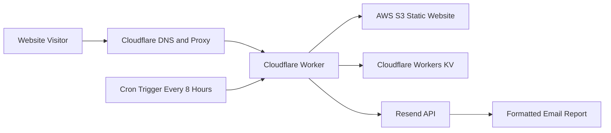
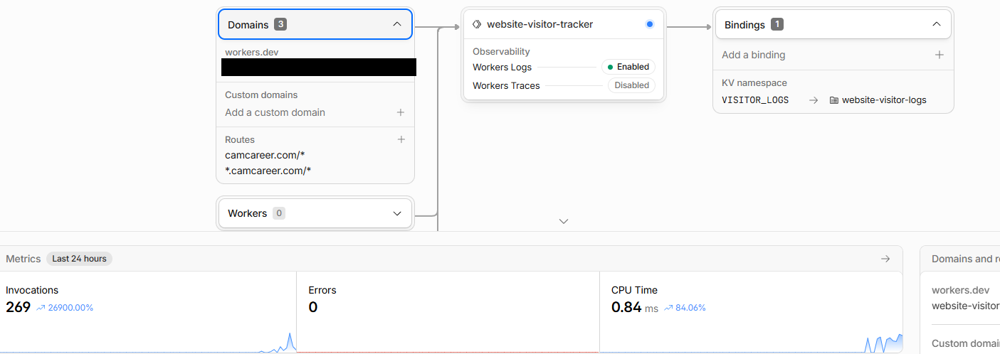

# Serverless Website Visitor Reporting System

A serverless visitor-reporting system built for my AWS S3-hosted portfolio website. The system uses Cloudflare Workers to process qualifying webpage requests, temporarily stores visitor activity in Workers KV, and sends organized email reports through the Resend API every eight hours.

**Live website:** [camcareer.com](https://camcareer.com)

## Project Overview

Standard website analytics provide useful aggregated traffic information, but I wanted a private reporting system that could provide additional technical details about qualifying visits to my portfolio website.

I implemented a Cloudflare Worker that runs before requests reach the AWS S3 website origin. The Worker filters out non-page resources and common automated traffic, records selected request information in Workers KV, and generates scheduled email reports.

The system is completely serverless. It does not require a traditional application server or a computer to remain running.

## Architecture



## Cloudflare Worker Configuration

The Worker is connected to both the root website domain and its subdomains. It also has access to the Workers KV namespace through the `VISITOR_LOGS` binding.



The configuration shown above includes:

- The `website-visitor-tracker` Worker
- Routes for the root domain and subdomains
- The `VISITOR_LOGS` Workers KV binding
- Worker invocation metrics
- Error monitoring
- Cloudflare Workers Logs

## Technologies Used

- JavaScript
- Cloudflare Workers
- Cloudflare Workers KV
- Cloudflare DNS and Proxy
- Cloudflare Worker Routes
- Cloudflare Cron Triggers
- AWS S3
- Resend API
- PowerShell
- Google Analytics 4
- GitHub

## How the System Works

### 1. AWS S3 hosts the website

The portfolio is a static website hosted in an AWS S3 bucket.

The bucket stores files such as:

```text
index.html
styles.css
script.js
images/
Projects/
PDF documents
```

AWS S3 remains the website origin and serves the actual HTML, CSS, JavaScript, images, and project files.

### 2. Cloudflare sits in front of AWS

The custom domain passes through Cloudflare before requests reach AWS S3.

Cloudflare provides:

- DNS management
- HTTPS
- Proxying
- Caching
- Security controls
- Edge request processing
- Access to Cloudflare Workers

This allows the Worker to inspect and process requests without moving the website away from AWS.

### 3. A Cloudflare Worker processes requests

The Worker runs when a visitor requests a page from the website.

It performs two jobs:

1. It allows the original request to continue to AWS S3.
2. It analyzes qualifying requests and records visitor activity in the background.

The website response is returned normally while visitor logging is handled asynchronously.

### 4. Non-page requests are filtered

Loading one webpage can generate requests for many separate resources:

```text
index.html
styles.css
script.js
profile-image.jpg
favicon.ico
resume.pdf
```

Without filtering, one page visit could incorrectly appear as several visits.

The Worker checks:

- HTTP request method
- Response status
- Response content type
- `sec-fetch-dest`
- Browser prefetch headers
- User-agent information

Only successful HTML document requests are recorded.

The Worker ignores resources such as:

- CSS files
- JavaScript files
- Images
- Fonts
- PDFs
- Icons
- Browser-prefetched pages

### 5. Common bots are filtered

The Worker checks the visitor's user-agent string for common automated traffic identifiers.

Examples include:

```text
bot
crawler
spider
headlesschrome
lighthouse
curl
wget
ahrefs
semrush
```

When Cloudflare provides Bot Management information, the Worker can also ignore verified bots or traffic with a low bot score.

This filtering reduces automated traffic in the reports, although no bot-detection method can identify every automated request.

### 6. Qualifying visitor information is recorded

For qualifying HTML page requests, the Worker records:

- IP address
- IPv4 or IPv6 type
- Approximate city
- State or region
- Country
- Approximate postal code
- Internet-provider organization
- First recorded activity
- Most recent activity
- Pages requested
- Page-view count
- Referring website
- Browser user-agent information

The location is approximate. It may be affected by:

- VPN connections
- Cellular networks
- Corporate networks
- Shared internet connections
- Internet-provider routing

### 7. Workers KV temporarily stores visits

The Worker stores unsent visitor records in a Cloudflare Workers KV namespace named:

```text
website-visitor-logs
```

The Worker accesses that namespace through this binding:

```text
VISITOR_LOGS
```

Inside the code, it is accessed as:

```javascript
env.VISITOR_LOGS
```

### 8. KV key names use SHA-256 hashing

The Worker creates a KV key using the visitor's IP address and the current calendar date.

The identifying portion of the key is hashed with SHA-256.

Example structure:

```text
visit:2026-07-26:hashed-value
```

This prevents the complete IP address from appearing directly in the KV key name.

The full IP address remains inside the private record so it can be included in the private email report.

### 9. Activity is grouped by IP address

When the same public IP loads multiple pages before a report is sent, the Worker updates the existing record instead of creating a separate visitor entry.

The record contains:

- First activity time
- Latest activity time
- Total recorded page views
- Each page requested
- Number of times each page was requested

For example:

```text
First visit: 1:15 PM
Last activity: 3:42 PM
Page views: 4
Pages:
  /                         3
  /Projects/projects.html   1
```

This helps identify repeated page activity, but it does not calculate complete browser sessions.

### 10. A Cron Trigger runs every eight hours

The Cloudflare Cron Trigger uses this expression:

```text
0 */8 * * *
```

The scheduled Worker runs every eight hours.

At each scheduled execution:

- If unsent visitor records exist, the Worker generates a report.
- If no visitor records exist, no email is sent.

The schedule runs independently from manual testing. Running a manual test does not reset or delay the Cron Trigger.

### 11. Resend delivers the email

The Worker sends reports using the Resend email API.

The API key is stored as an encrypted Cloudflare secret:

```text
RESEND_API_KEY
```

The Worker never exposes the API key in the public website or GitHub source code.

The email includes a formatted HTML table and a plain-text fallback.

Report details include:

- Number of unique IP-based visitors
- Total page views
- IP address
- IPv4 or IPv6 label
- Approximate location
- Internet provider
- First activity time
- Latest activity time
- Requested pages
- Referring website

### 12. Reported records are deleted

After Resend successfully accepts the report email, the Worker deletes the included records from Workers KV.

This prevents the same activity from appearing in future reports.

Unsent records also receive an eight-day expiration period:

```javascript
expirationTtl: 8 * 24 * 60 * 60
```

The expiration acts as a backup retention limit if email delivery repeatedly fails.

### 13. Manual testing is protected

The Worker includes a manual report endpoint:

```text
/__visitor-report-test
```

The endpoint only accepts a `POST` request containing the correct `ADMIN_TOKEN` header.

Example PowerShell structure:

```powershell
Invoke-RestMethod `
  -Method Post `
  -Uri "https://example.com/__visitor-report-test" `
  -Headers @{"x-admin-token"="<YOUR_ADMIN_TOKEN>"}
```

The real administrative token is stored as an encrypted Cloudflare secret and is never included in this repository.

## Cloudflare Configuration

### Workers KV binding

```text
Variable name: VISITOR_LOGS
KV namespace: website-visitor-logs
```

### Routes

```text
camcareer.com/*
*.camcareer.com/*
```

The first route covers the root domain.

The second route covers subdomains such as:

```text
www.camcareer.com
```

These are Worker Routes rather than Custom Domains because AWS S3 remains the website origin.

### Required variables and secrets

| Name | Type | Purpose |
|---|---|---|
| `VISITOR_LOGS` | KV binding | Connects the Worker to temporary visitor storage |
| `RESEND_API_KEY` | Secret | Authenticates requests to the Resend API |
| `REPORT_TO_EMAIL` | Plaintext variable | Defines the report destination |
| `REPORT_FROM_EMAIL` | Plaintext variable | Defines the email sender |
| `ADMIN_TOKEN` | Secret | Protects the manual report endpoint |
| `EXCLUDED_IPS` | Optional plaintext variable | Prevents selected IP addresses from being recorded |

Example values are provided in:

```text
.env.example
```

Real credentials and personal information are not included in the repository.

## Repository Structure

```text
cloudflare-visitor-reporting-system/
├── screenshots/
│   ├── README.md
│   └── 01-cloudflare-worker-overview.png
├── src/
│   └── index.js
├── .env.example
├── .gitignore
└── README.md
```

### `src/index.js`

Contains the Cloudflare Worker application logic.

### `.env.example`

Documents the required environment variables using safe placeholder values.

### `.gitignore`

Prevents common secret, environment, dependency, and temporary files from being committed.

### `screenshots/`

Contains sanitized project screenshots with visitor and account information removed.

## Security Measures

The project includes several security controls:

- API keys are stored as encrypted Cloudflare secrets.
- The administrative token is stored as an encrypted secret.
- Credentials are not hardcoded in the source code.
- Visitor data is escaped before being inserted into HTML reports.
- KV key names use SHA-256 hashes.
- Manual reporting requires an authenticated header.
- Records are deleted after successful reporting.
- Unsent records expire automatically.
- Common bots and non-page resources are filtered.
- Real visitor records are excluded from GitHub.
- `.gitignore` helps prevent accidental secret uploads.

## Privacy Considerations

This project processes potentially sensitive technical information, including IP addresses and approximate location information.

To reduce unnecessary retention:

- KV storage is temporary.
- Reported records are deleted.
- Unsent records expire.
- Reports are sent only to a private email account.
- Real visitor data is not published in the repository.
- Screenshots are sanitized before publication.

Anyone implementing a similar system should evaluate applicable privacy requirements, limit access to stored information, and avoid using IP addresses as proof of a visitor's identity.

## Important Limitations

### IP addresses do not identify a specific person

An IP address identifies a network connection, not necessarily an individual.

### Several people may share one IP

People in the same household, company, school, or public network may appear as one visitor.

### One person may use several IP addresses

A person may appear more than once when switching between:

- Wi-Fi and cellular data
- Home and work networks
- VPN servers
- Different internet providers

### VPNs affect location

The report normally displays the approximate location of the VPN server rather than the visitor's actual physical location.

### An open tab does not continuously generate visits

Leaving the website open does not create ongoing activity.

A new record or page view generally requires another HTML request, such as:

- Refreshing the page
- Opening another HTML page
- Reopening the website
- Navigating between separate website pages

### Page views are not complete sessions

Multiple recorded page views may represent:

- Separate visits
- Refreshes
- Multiple tabs
- Navigation between pages

The current system does not calculate formal user sessions.

### Bot filtering is not perfect

Some automated requests may resemble normal browsers and pass through the filters.

## Testing Performed

The complete workflow was tested using:

- Normal browser sessions
- Incognito browser sessions
- VPN connections
- IPv4 traffic
- IPv6 traffic
- Multiple page requests
- Workers KV record inspection
- Scheduled Cron configuration
- Protected PowerShell requests
- Resend email delivery
- Record deletion after successful reporting
- Worker invocation and error monitoring

## What I Learned

This project provided practical experience with:

- Serverless architecture
- Edge computing
- Cloudflare Worker development
- Cloud service integration
- Workers KV bindings
- Key-value data storage
- Cron scheduling
- REST API authentication
- Secret management
- Request-header analysis
- IP geolocation metadata
- Bot and asset filtering
- HTML email generation
- Asynchronous background processing
- Cloudflare routing
- AWS S3 integration
- PowerShell API testing
- Troubleshooting multi-service workflows

## Future Improvements

Potential future improvements include:

- A private historical analytics dashboard
- Cloudflare D1 for long-term structured storage
- Configurable data-retention periods
- Improved session identification
- Additional bot-detection controls
- CSV report exports
- Weekly and monthly summary reports
- Optional anonymization of stored IP addresses
- Automated tests for Worker functions

## Responsible Use

This project is intended for traffic analysis and security monitoring on websites controlled by the operator.

It should not be used to claim that an IP address proves the identity or exact physical location of a visitor.
